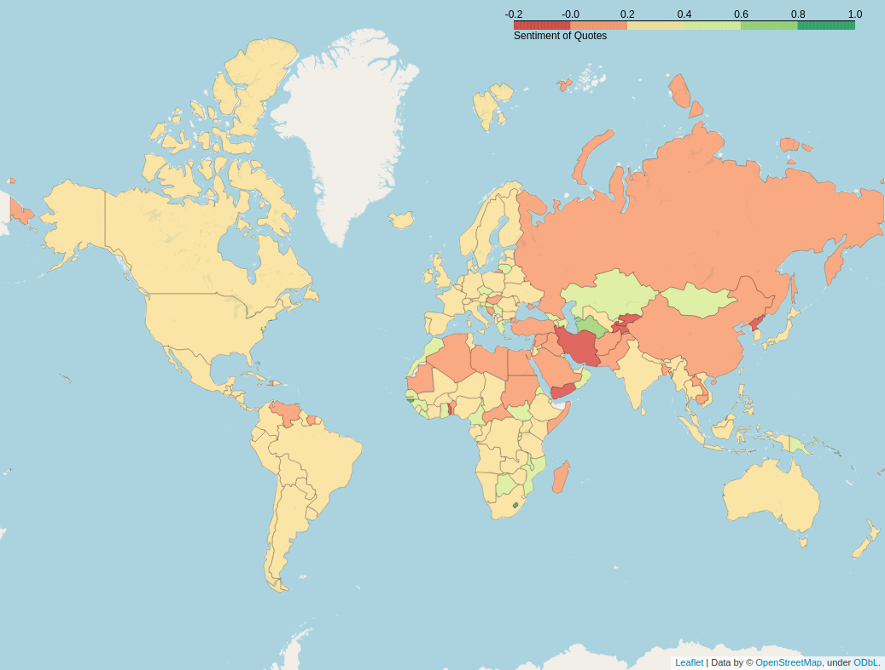
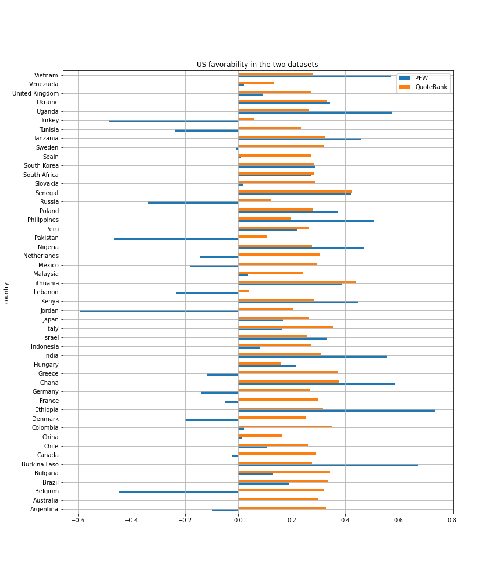
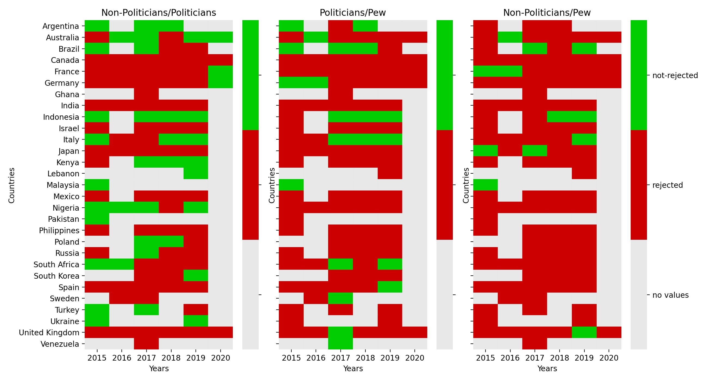
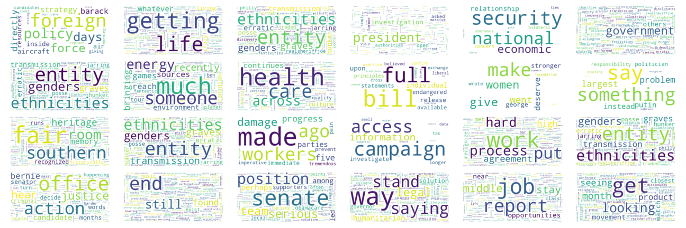

 

The USA is one of the biggest geopolitical strengths on the planet. Its influence across the world is unmatched, with several Cultural and Economic industries impacting nearly every countries. However, this hegemony is not unanimous and several countries are in direct conflict with the USA and the favorability towards the US is not complete in other countries. Assessing how favorable are countries to the USA thus seems as an interesting question. 

In this data story, we aim to provide an answer to this by analysing what people from different nationalities say about the USA.

### PEW analysis, what does it says ? 

Pew Research Center is an American center that conducts public opinion polling to analyze the issues, attitudes, and trends shaping the world. They study a wide range of topics such as politics, immigration, ethnicity, religion, economy, and science. One of the principal subjects in these researches is U.S. global image and reputation, i.e., what people around the world like about American society and politics. In Pew's survey, random people worldwide are asked to express an opinion of the U.S. The provided choices are "Very favorable," "Somewhat favorable," "Somewhat unfavorable," "Very unfavorable," "Refused," and "Don't know." The pew research center releases the results of this study once per year.
In this work, we extract the U.S. favorability from the PEW datasets for 2015-2020, the same years that we have data in QuoteBank.  
The following figure shows the average of the U.S. favorability in different countries every year. The blank boxes represent the years that the study is not conducted in that specific country.

As we see in this heatmap, the study covers only 52 out of 195 countries in the world. In addition, only 9 countries in this study have the results for all the years between 2015 till 2020.

### Quotebank : what does it says ? 

Quotebank [1] is an open corpus of 178 million quotations extracted from 162 million English news articles published between 2008 and 2020. The quotations were extracted and attributed using Quobert; a distantly and minimally supervised end-to-end, language-agnostic framework for quotation attribution. In this work, we want to evaluate the US favorability, specifically between Barak Obama and Donald Trump's presidency; thus, we consider only years from 2015 to 2020.

[1] Timoté Vaucher, Andreas Spitz, Michele Catasta and Robert West. 2021. Quotebank: A Corpus of Quotations from a Decade of News.

### Pew vs the Quotebank
The major drawback of the pew dataset is its incompleteness as we said. But by doing a sentiment analysis over the quotebank dataset over the quotes speaking about the U.S.A could in fact help to infer the "real" sentiment of the population of countries for which we do not have any data from the Pew dataset. It is sure that the two datasets were generated completely in a different way, so we should expect differences, but maybe theses dissimilarities are not so significant. So… let's try !
First, we should filter the quotebank so that we drop quotations not related to the U.S.. To do so, we only keep sentences containing keywords such as "U.S.A.", "United States". Afterwards, one need to label the quotes, the nltk library of python offers us a simple way to do this. Then foreach country we compute the mean sentiment of all its quotes and finally compare it with Pew. Here are the results : 

### A new comparable study

As seen above, comparing the scores from the PEW data and the Quotebank does not provide usable results. It indeed seems that both values are not comparable as they are. However, it is possible to compare the PEW data and the Quotebank data between different years. Doing so provides trends for the two sources, and these could be then benchmarked one against the other.

Looking at the sentiment before and after a special event could provide a shift in opinion sufficiently important for having significant results. With this in mind, a change of presidency seems to be a good event. For the last two years of Obama's and Trump's presidency, the sentiment per country is thus compared for PEW and Quotebank.

At first, we considered the quoting bank from 2015 to 2020 and manually defined keywords "US," "U.S," "USA," and "United States," then extracted the data that contained these keywords. We identified the speaker nationality of these quotes and performed a sentiment analysis. We investigated and compared the distribution of the sentiments analysis results between the quoting bank and PEW for 29 countries. We observed that only 10 countries from the quoting bank over 29 countries from PEW follow the same behavior. For example, in the figure below, we compare the US favourability seen by India and Nigeria based on our references, PEW, and the quoting bank. By comparing the mean and median, we observe that the US favourability decreased for both countries. However, the p-values of the quoting bank are high, which indicates that our evidence is not strong enough to suggest an effect exists in the US favourability. In the following section, we study different ideas to enhance the comparability of the PEW and quoting bank.

### This is an issue ? Could we improve comparability ? 

Even with relative comparison, the results seem to differ significantly between PEW and Quotebank. In this section, several potential sources of bias and imporvements are studied to assess whether taking them into account can improve the comparability of the two datasets. 

#### Sentiment analysis tool 

Until now, all the sentiment analysis has been done using the Natural Language Toolkit (NLTK) library. This is a referene for sentiment analysis, but many other tools are available, and could potentially help up improve our results. It is indeed possible that the NLTK tool does not apply well to our data and some other would better analyse the Quotebank citations. 

To verify this, a random sample of 50 quotes was extracted and a sentiment score (-1, -0.5, 0, 0.5, 1) was assigned by humans to each quote. The different tools were then tested on the sentiment score were compared. The tools used were : NTLK, Flair, and TextBlob. The accuracies are shown below : 

| | NLTK | TextBlob | Flair | 
|-------|:-------:|-------|-------| 
|Accuracy| 54 % | 42 % | 56 % |

NLTK is thus not the most accurate tool for the data at hand, as its accuracy was of 54% compared to Flair, with 56%. Despite the quite low difference between both, this missmatch in sentiment might be a reason for the discrepencies between the PEW and Quotebank analysis. Using Flair instead could potentially be a good change, when we consider that there is a quite high variance due to the small size of the test set. However, the Flair accuracy is still quite low, so it will still incurr some uncertainties, albeit at a lower scale.  
As a side note, Flair uses neural networks internally to proceed, therefore using GPU's to scale with the dataset size was not an option.

#### Keyword enrichment

We considered the quoting bank from 2015 to 2020, containing 18.702Go of data. At first, we considered a manual approach where we identified the relevant keywords for our objective. We defined keywords "US," "U.S," "USA," and "United States," then extracted 253.1Mo of data that contained these keywords. We identified the speaker nationally using Wikidata, a free database to support Wikipedia. It enables us to access additional metadata such as nationality about the speakers in the Quotebank dataset. Finally, we performed sentiment analysis which is a text analysis that determines polarity within the text. Then we study the positiveness or negativeness of the quotes of all countries towards the United States.

However, we will enrich the keywords to make our sentiment analysis results more attractive and trustworthy. Building a strong keyword list is crucial in any search in data analysis. To achieve this goal, we extract all American speakers from Wikidata and determine which ones are present in the "quotes-2019-nytimes.json.bz2" dataset. We discover the most frequent American speakers and create enriched keywords. Thus, we filter the quotes from 2015 to 2020 containing one of the new keywords.

#### Reducing bias : Media sources

A first possible source of bias lies I the medias. Indeed, even if attempting (or not) to be impartial on the subjects treated, articles are still written by humans and carry thus some point of view and the question treated. For this reason, it is possible that the quotes included in articles are selected to fit a narrative, discarding the quotes going in a opposing direction, incurring bias in the quotation corpus that is Quotebank. 

The same phenomenon could also occur at the media level. Media have clear political, social, or geopolitical views which can also lead to a selection process of quotations. Therefore, when applying sentiment analysis on quotes from these sources, the sentiment could be intensified and lead to bias in our analysis.
Identifying media with such behaviour is thus important as eliminating them could provide better data for the project. It could make the analysis go from “how favourable are countries to the US as seen by medias?“ to “how favourable are countries to the US” .

A media bias could be regarding the target of the sources : the US1. Some medias could keep only positive or negative quotes about the USA making their sentiment score reach more extreme values. One could assume that if this is not the case, positive and negative sentiment could approximatively even out, leading to a median score in the vicinity of 0. 

The median sentiment and distribution of the 30 most common medias are plotted below : 

We can see that most of them indeed have a media score in the vicinity of 0, going from about -0.1 to 0.3. There is however one media that seems to stand out, with a much higher sentiment score beyond  0.4. This media is Einnews and it thus seems to have a different perception of sentiment towards the US. 
This distinction is further made statistically significant with a mean p-value of 1.25*10^-16 when doing a t-test between its distribution and the distribution of all the other medias. This is further enhanced by the p-value heatmap shown below. Einnews is indeed the only media with no p-values above 0.05 for any of the other medias. It is true that some other medias seem to have low link to the others, but they still have a p-value over 0.05 with at least one other media. 

 It is thus clear that the quotation sentiment from Einnews does not come from the same distribution as the others, and looking at its higher median sentiment, it seems that it infers a positive bias towards the USA. Filtering this media out could therefore lead to improved results and a dataset more comparable to the PEW data. 

### Reducing bias : Politicians vs non-politicians
As we consider politicians, one could have the prejudgement that their sentiments does not reflect the overall opinion of their country with respect to the U.S. indeed, there are political and/or economical concerns to consider when a politician make any public declaration, in particular when he is part of the government.  
As a first result, the proportion of the quotes made by politicians represents more than 38% of the dataset speaking about the United States each year. In addition, around 13% of the speaker are involved in politics. This is a first indication that the quotebank is not equally distributed with respect to the profession, and that some people's opinion (here the politicians) "counts" more than others due to the number of quotes they have made.

Studying the difference of distribution of the politicians, non-politicians and the pew dataset through the computation of the p-value gives us interesting results. As a side remark, we have chosen an alpha level of 0.05 for a two-sided statisic test and we have also removed the countries that have less than 20 different speakers to not get too noisy values for the statistic test.

To begin with, the proportion of countries for which we have no strong evidence that the mean is the same for the non-politicians and the politicians is clearly superior than when we compare them to the pew dataset (37.2% compared to 9.9% and 16.4% respectively). Another fact is that in average, the politician dataset seems to be closer to the pew dataset than the non-politician dataset.  
But in fact, when we look closer to the outcome we observe that there is a correlation between the list of countries that do not reject the null hypothesis when comparing the politicians and the non-politicians and the respective list of countries that do not reject the null hypothesis between the PEW dataset and the (non-)politicians. In other words, when the distribution between the PEW dataset and the (non-)politicians is similar for a given country, it increases the chance that the distribution of the sentiments of the politicians and the ones of the non-politicians look also alike. Here is a graph representing this :

As an example, when we look at :  
a. the list of countries that in a given year the distribution of the politicians and the pew dataset were similar  
b.  the list of countries that in a given year the distribution of the non-politicians and the politicians were similar  
And then do the ratio of the number of countries of the list a. appearing in the list b., and average over the years, we get a ratio of 55.7%. Nevertheless, a possible wrong deduction would say that if the politicians and the non-politicians share approximately the same opinion, then the similarity between their quotes sentiment and the pew sentiment value is greater. As an counter-example, we observe in the graph that four years over six, there was not enough indication that the distribution of the politicians and the non-politicians where different in Nigeria. However, there has always been over all the years a strong evidence that the Nigeria's sentiment distribution of the quotes were not sharing the same distribution as the pew dataset.

To conclude, our first belief that the quotes of the politicians induce a bias was not clearly observed in practice, in contrary, they were in average slightly closer to the "ground truth" in overall. For this reason no further filtering was made at this step.

### Reducing bias : Speaker importance
Another important aspect that we have neglect is that the quotebank we have there is not one entry per individual as in the pew dataset, but per quotation. As a result, a speaker that appears frequently in our dataset will have a greater importance, since is opinion will be taken into account multiple times. To avoid this phenomenon, we have considered to average the sentiment of each individual for each year to be more closer to how the pew dataset was made. 

### Is it better now ? 

Trump vs Obame v2

### Good, now, what do we learn from quotebank on US favorability across the world ? 

Now that the Quotebank data seems to be more aligned with the PEW dataset, it is time to look for an answer to our main question : How favourable are countries to the USA? To attempt to provide an answer, year per year data on mean sentiment, main positive and negative topics and difference between politicians and non-politicians were aggregated in the following interactive map. 
By selecting a year in the top right, one can see all the data corresponding. The politicians vs non-politician data has been normalised, with values going from 0 to 1.

<iframe src="final_map.html" style="width: 1000px;  height: 400px; border: 0px"></iframe>

It is first interesting to look at the countries with the most tense geopolitical relationships with the US : Russia, Iran, China, and North Korea. Overall, the sentiment displayed by these countries seems logical, with it being neutral at best. It even gets worse in 2019, with Russia and Iran becoming quite significantly negative. 
 For these countries another interesting aspect to look at are the most common topics. Nearly for every year, the most positive topic is themselves (Russia for Russia…). This makes sense, as people originating from the countries would tend to defend their country and thus say positive things about it when in altercation with their main competitor. Regarding negative topics it often relates to the USA foreign actions, with for example Russia being negative about the USA in Iran in 2019 and Iran being about the President himself. This once again seems to make sense, as these external interventions are often the reasons for the conflictual situations. 

This stability is further enhanced by the low difference between politicians and non-politicians views, as European countries have very low difference. In opposite, African countries, which have a very high yearly variation, are also the countries with the highest politician non-politician scores. This underlines once more the instability of the sentiment towards the USA. It should however be noted that these trends may be exacerbated by a lower number of quotes per country.

From the interactive map, we can clearly see that the sentiment towards the USA varies strongly from one year to the other. For example, Libya was very unfavourable of the US in 2017, with a score between -1 and -0.7, but much more favourable the year after with a score above 0.5, before settling at a more standard value of around 0.1 in 2019. These very sharp variation could be explained by the fact that the quotations the analysis is based on are dependent on the events occurring at specific times, making them quite time influenced. 
In Europe however, there is much less temporal variability, with most countries keeping a seemingly neutral feeling towards the USA. Sweeden for example remains for example between 0 and 0.3 from 2015 to 2019. It is likely that this stability is induced by much stabler geopolitical relationships with the USA, making them less sensible to short term event induced variability.

### Conclusion

Using the quotes in  Quotebank was interesting to assess the sentiment of countries towards the USA, but the data contained significant bias that needed to be accounted for to yield interesting results. Some medias indeed did not broadcast a representative variety of sentiments, and the speaker importance led to some point of views being over-representative of a population. 

Even after this step of bias removal, providing a clear answer to the favourability towards the USA questions seems to be very complex, given the number of parameters it entails. Using the Quotebank data however enables us to gain some insight on the trends linked to this question. Regarding well established conflictual countries, these quotes indeed seem to validate the trends already known. For more favourable countries, the sentiment towards the USA does not reach extreme positive nor negative scores but remains close to neutrality. 

<iframe src="ldavis_150.html" style="width: 1000px;  height: 400px; border: 0px"></iframe>

